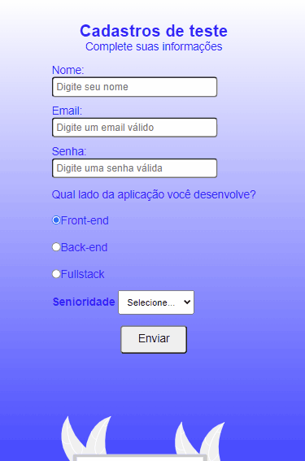

# Validação De Formulário

### Esse projeto foi desenvolvido para fazer a validação de um formulário

- Sabe-se que pode ser feito essa validação pelo próprio HTMl, mas resolvir me superar e fazer essa validação usando apenas o Javascript. E esse foi o resultado!

## Veja:

### Loyout para notebook e desktop

### Loyout para celulares e tablets

🚀Tecnologias usadas:
- ✔HTML
- ✔CSS
- ✔JAVASCRIPT

